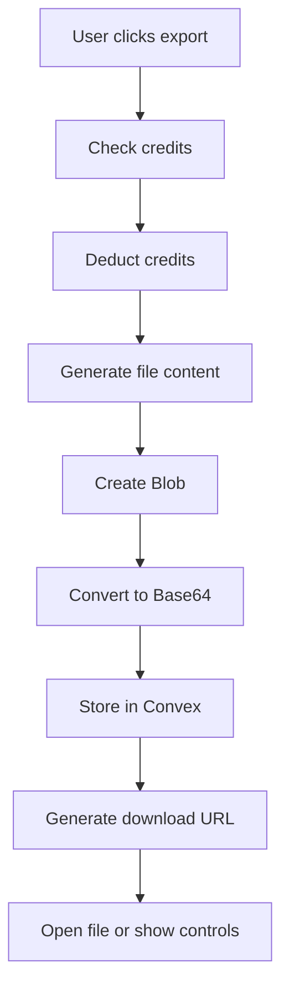

# Export Functionality Documentation

## Overview

The AI Travel Planner includes a robust export system that allows users to download their travel itineraries in multiple formats. This system is designed to work seamlessly across different platforms, including Telegram WebApp environments.

## Features

### Export Formats
- **TXT Format** (1 credit) - Plain text version of the itinerary
- **PDF Format** (2 credits) - Professional PDF document with tables and formatting
- **ICS Format** (1 credit) - Calendar file compatible with Google Calendar, Outlook, and other calendar applications

### Platform Support
- ✅ **Web Browsers** - Standard browser download functionality
- ✅ **Telegram WebApp** - Optimized for Telegram Mini Apps with proper file opening
- ✅ **Mobile Devices** - Touch-friendly interface and mobile-optimized downloads

## Technical Architecture

### Frontend Components

#### ExportModal Component
**Location**: `apps/web/components/auxiliary/ExportModal.tsx`

**Features**:
- Credit-based export system
- Real-time credit balance display
- Format-specific cost information
- Post-export file management controls
- Clean, responsive UI design

**Key Functions**:
- `handleExport()` - Main export orchestration
- `createTxtContent()` - Generates plain text content
- `createIcsContent()` - Generates iCalendar format
- `createPdf()` - Generates PDF with tables and formatting

#### useFileExport Hook
**Location**: `apps/web/hooks/useFileExport.ts`

**Features**:
- Convex file storage integration
- Base64 blob conversion for reliable storage
- Platform-specific file opening methods
- Telegram WebApp API integration
- Comprehensive error handling

**Key Functions**:
- `exportAndStoreFile()` - Stores file in Convex and opens it
- `openStoredFile()` - Opens previously stored files
- `blobToBase64()` - Converts blobs for storage
- `callTelegramMethod()` - Handles Telegram WebApp API calls

### Backend Infrastructure

#### Convex File Storage
**Location**: `convex/`

**Schema** (`convex/schema.ts`):
```typescript
exportedFiles: defineTable({
  storageId: v.string(),           // Convex storage identifier
  filename: v.string(),            // Original filename
  contentType: v.string(),         // MIME type
  userId: v.id('users'),          // User who created the file
  size: v.number(),               // File size in bytes
  createdAt: v.number(),          // Creation timestamp
  expiresAt: v.optional(v.number()), // Expiration timestamp (72 hours)
})
```

**Actions** (`convex/actions.ts`):
- `storeExportedFile` - Stores file content in Convex storage
- `cleanupExpiredFiles` - Removes files older than 72 hours (internal)

**Mutations** (`convex/mutations.ts`):
- `createExportedFile` - Creates database record for exported file
- `deleteExportedFile` - Removes file record from database

**Queries** (`convex/queries.ts`):
- `getExportedFileByStorageId` - Retrieves file metadata
- `getUserExportedFiles` - Gets user's active files
- `getExpiredFiles` - Finds files older than 72 hours

**HTTP Endpoints** (`convex/http.ts`):
- `GET /files/download?storageId=...` - Serves files with proper headers

**Scheduled Tasks** (`convex/crons.ts`):
- File cleanup runs every 6 hours automatically

## File Lifecycle

### 1. Export Process


### 2. File Storage
- Files are stored in Convex File Storage with unique storage IDs
- Database records track metadata and expiration times
- Files expire automatically after 72 hours

### 3. File Access
- **Direct opening**: Telegram WebApp API or window.open()
- **Manual controls**: "Open File" and "Re-download" buttons
- **URL access**: Direct HTTP download via Convex endpoint

### 4. File Cleanup
- Automated cleanup runs every 6 hours
- Removes files older than 72 hours
- Deletes both storage files and database records

## User Experience

### Export Flow
1. **Open Export Modal** - Click export button from itinerary view
2. **Choose Format** - Select TXT, PDF, or ICS based on needs and credits
3. **Automatic Processing** - Credits deducted, file generated and stored
4. **File Access** - File opens automatically or manual controls appear
5. **Expiration Notice** - User informed about 72-hour expiration

### Manual Controls
After export, users see:
- **File status** - Shows filename and "ready" status
- **"Open File in Browser"** - Primary action for file access
- **"Re-download File"** - Alternative download method
- **Expiration notice** - Toast messages include 72-hour warning

### Error Handling
- **Insufficient credits** - Clear error message with credit requirement
- **Export failures** - Generic error with retry suggestion
- **File access issues** - Fallback methods and helpful instructions
- **Network problems** - Graceful degradation with manual options

## Platform-Specific Features

### Telegram WebApp Integration
- **Proper API Usage**: Uses `web_app_open_link` for file opening
- **Fallback Methods**: Multiple approaches for different Telegram versions
- **WebView Proxy**: Supports both mobile app and web versions
- **Touch Optimization**: Mobile-friendly button sizes and interactions

### Standard Web Browsers
- **Native Downloads**: Uses browser's built-in download functionality
- **New Tab Opening**: Files open in new tabs when possible
- **Popup Handling**: Clear instructions for popup blockers
- **URL Management**: Proper cleanup of object URLs

## Security & Privacy

### File Access Control
- Files are associated with specific users
- No public file listing or browsing
- Storage IDs are unguessable unique identifiers
- Automatic expiration prevents long-term storage

### Data Handling
- Files never contain sensitive personal information
- Content is limited to travel itinerary data
- Base64 conversion ensures proper encoding
- Cleanup ensures no permanent data retention

## Configuration

### Environment Variables
```bash
# Required for file serving
NEXT_PUBLIC_CONVEX_URL=https://your-project.convex.site
```

### Export Costs
**Location**: `apps/web/config/operationCosts.ts`
```typescript
export const OPERATION_COSTS = {
  exportTxt: 1,    // 1 credit for TXT export
  exportPdf: 2,    // 2 credits for PDF export  
  exportIcs: 1,    // 1 credit for ICS export
};
```

### File Expiration
- **Default**: 72 hours (3 days)
- **Configurable**: Modify expiration in `createExportedFile` mutation
- **Cleanup Frequency**: Every 6 hours (configurable in crons.ts)

## Development

### Adding New Export Formats
1. **Add format option** in `operationCosts.ts`
2. **Create content generator** function in ExportModal
3. **Add case** to export switch statement
4. **Update TypeScript types** for new format
5. **Test** across different platforms

### Modifying File Storage
1. **Update schema** in `convex/schema.ts`
2. **Modify actions/mutations** as needed
3. **Update frontend types** to match
4. **Run migration** if schema changes
5. **Test file operations** thoroughly

### Debugging File Issues
1. **Check browser console** for error messages
2. **Verify Convex deployment** status
3. **Test file URLs** directly in browser
4. **Check network requests** in dev tools
5. **Validate environment variables**

## Troubleshooting

### Common Issues

#### "File not opening in Telegram"
- **Cause**: Blob URLs don't work in Telegram WebApp
- **Solution**: System automatically uses Convex URLs instead

#### "Export button disabled"
- **Cause**: Insufficient credits for selected format
- **Solution**: User needs to purchase more credits

#### "File not found" errors
- **Cause**: File may have expired (>72 hours)
- **Solution**: Re-export the file

#### "Export failed" message
- **Cause**: Network issues or Convex service problems
- **Solution**: Retry export, check internet connection

### Development Debugging
```bash
# Check Convex deployment
npx convex dev

# View file storage in dashboard
# Navigate to your Convex dashboard -> File Storage

# Check cron job execution
# Navigate to your Convex dashboard -> Functions -> Scheduled
```

## Performance

### File Size Limits
- **Convex HTTP Response**: 20MB maximum
- **Typical Export Sizes**:
  - TXT: 1-5KB
  - ICS: 2-10KB  
  - PDF: 50-500KB

### Storage Optimization
- Base64 encoding adds ~33% to file size
- Automatic cleanup prevents storage bloat
- Efficient blob-to-storage conversion
- Minimal database overhead

## Future Enhancements

### Potential Improvements
- **Batch exports** - Multiple formats at once
- **Custom templates** - User-defined PDF layouts
- **Sharing links** - Temporary public file access
- **Export history** - Track of all user exports
- **Format previews** - Show content before export

### API Extensions
- **Webhook notifications** - Alert on file expiration
- **Bulk operations** - Admin file management
- **Analytics** - Export usage statistics
- **Third-party integrations** - Direct calendar sync

---

*Last updated: $(date)*
*Version: 1.0*
